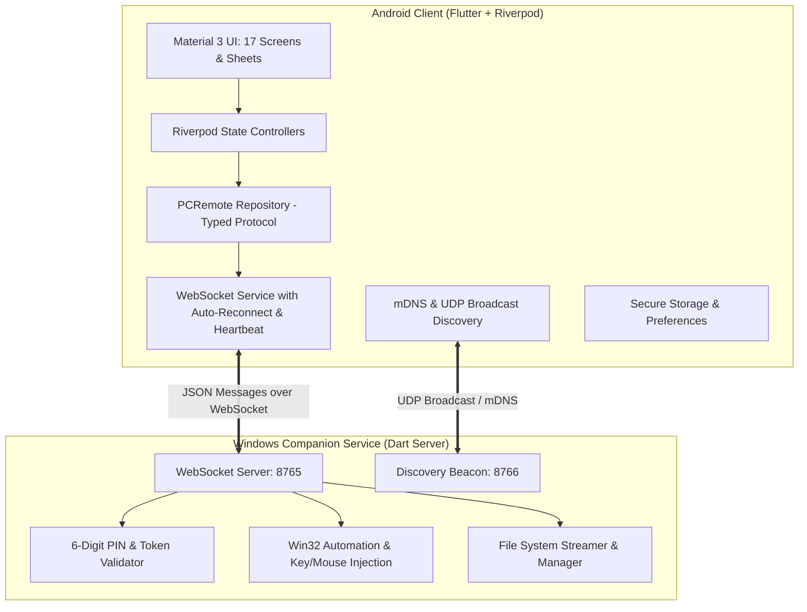

# PCRemote (Wintroller) 🎮💻

A modern, responsive, and secure **remote control app for Windows PCs and laptops**, built with **Flutter (Material 3)** for Android and a lightweight, standalone **Windows Companion Service** in Dart.

---

## 📸 Overview & Features

PCRemote allows you to take command of your PC over your local Wi-Fi with ultra-low latency:

- 🖱 **Trackpad & Mouse**: Fullscreen gesture surface with 60Hz throttled cursor tracking, single-tap left click, two-finger right click, two-finger scroll, and sensitivity tuning.
- ⌨️ **Keyboard Remote**: Real-time system IME text capture with live typing / batch submit modes, plus dedicated quick keys (`Esc`, `Tab`, `Win ⊞`, `Ctrl`, `Alt`, `Del`, `Backspace`, `Enter`, and Arrow keys).
- 🎵 **Media & Audio**: Media session playback (Play/Pause, Next, Previous), fine-grained debounced Volume Slider, repeat-on-hold volume buttons, audio mute toggle, and microphone mute.
- ⚡ **System Power**: Lock workstation, Sleep, and Hibernate instantly, plus protected confirmation dialogs for destructive actions (Shutdown, Restart, Log Off).
- ☀️ **Display Brightness**: Smooth 0–100% brightness control with quick presets (Low 25%, Medium 50%, High 100%).
- 📁 **File Explorer & Transfers**: Browse remote directories with breadcrumbs, view file metadata, download files to mobile phone storage, and upload local files via `file_picker`.
- 🔗 **Zero-Config Pairing**: Instant LAN discovery via UDP beacon (`8766`), QR code camera scanning (`mobile_scanner`), and 6-digit PIN fallback.
- 📱 **Device Management & Settings**: Multiple paired PC profiles, active status badges, swipe-to-forget (`Dismissible`), Dark/Light themes, and Haptic feedback.

---

## 🏗 Architecture



---

## 🚀 Getting Started

### 1. Windows Companion Service

1. Open PowerShell or Command Prompt on your Windows PC:
   ```bash
   cd windows_companion
   dart bin/server.dart
   ```
2. The companion service will start:
   ```text
   ====================================================
      PCRemote Windows Companion Service Running       
   ====================================================
   WebSocket URL : ws://0.0.0.0:8765/ws
   Pairing PIN   : 470310
   Pairing Token : RAXehIU-Z4uF9-eER5tQNj1ebG8CmLge
   Host Name     : DESKTOP-XXXXX
   ====================================================
   UDP Discovery Beacon active on port 8766.
   ```

### 2. Android Client App

1. Ensure your phone and PC are connected to the **same Wi-Fi network**.
2. Run the Flutter app:
   ```bash
   flutter run
   ```
3. Or build the debug APK:
   ```bash
   flutter build apk --debug
   ```

---

## 🧪 Testing

Run the automated test suite:
```bash
flutter test
```

---

## 📄 License
This project is open-source and available under the MIT License.
